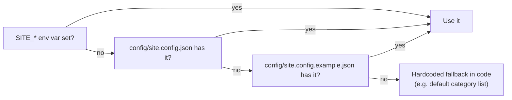
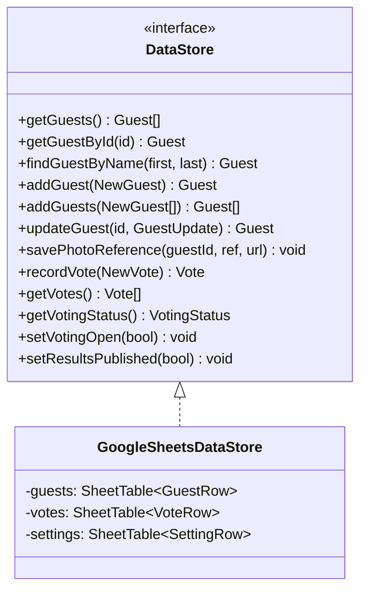
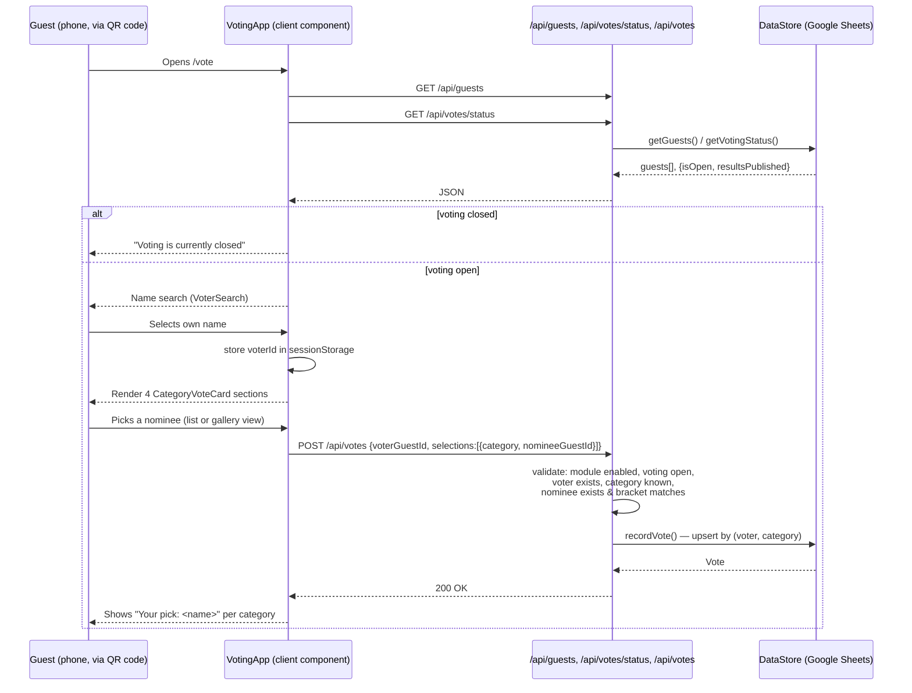
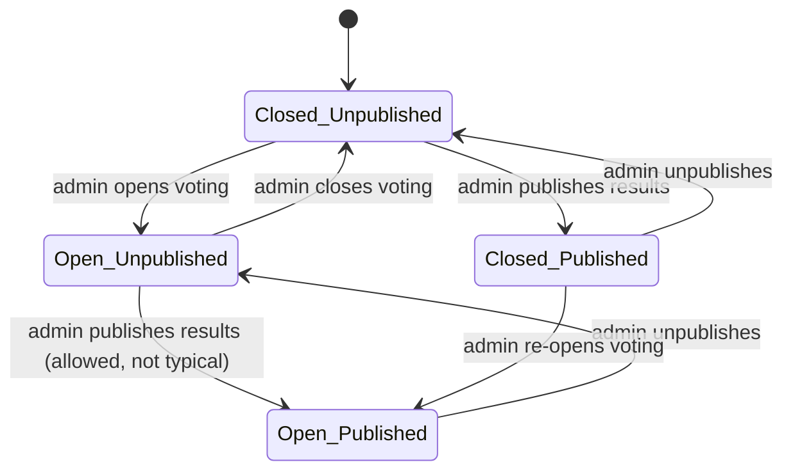
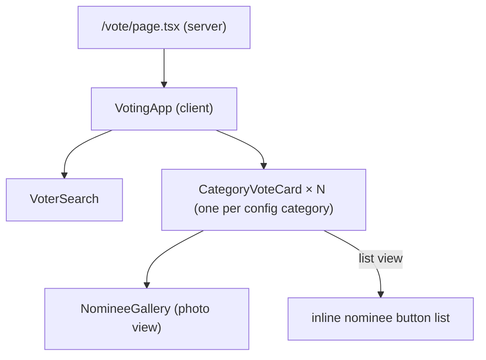
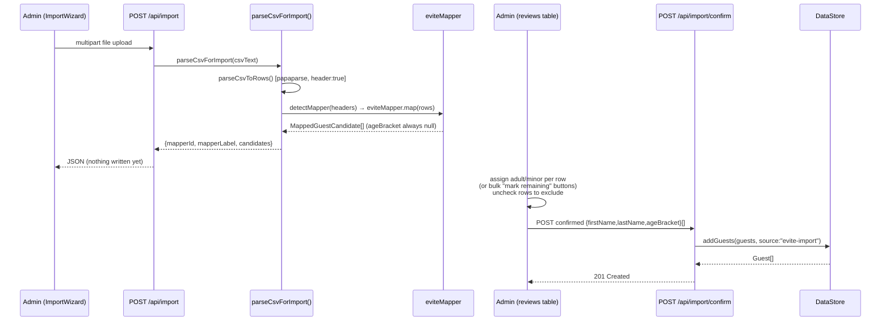
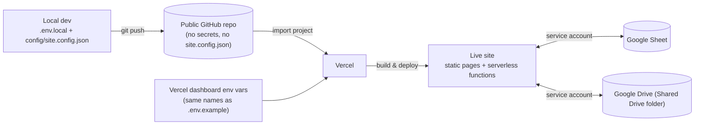

# Thriller Night Website — Design Document

> **Purpose of this document**: a complete, implementation-accurate map of what was actually built, for a reader (human or AI) who has not seen the code. It describes the system as it exists today, not as it was proposed. For the original product requirements, see [`thriller-night-website-requirements.md`](thriller-night-website-requirements.md) in this same folder — this document is the "how," that one is the "what/why."
>
> Status: Phase 1 complete. Costume Voting module fully built; Invitation/RSVP module is a structural stub only (disabled by default).

---

## 1. What this project is

A reusable, open-source website for an annual Halloween party ("Thriller Night"). It has two independently toggleable modules:

- **Costume Voting** — guests vote on costume contest winners in four categories, fully built in Phase 1.
- **Invitation/RSVP** — a landing page + RSVP form, stubbed out in Phase 1, to be fully built in Phase 2.

The whole point of the project is that it must **not** contain any hardcoded personal information, guest data, or event-specific copy — everything that changes year to year (event name/date/times, theme colors/fonts/images, feature toggles, costume categories) lives in runtime configuration, and all guest/vote/photo data lives in a Google Sheet, never in source code.

---

## 2. Technology choices and why

| Concern | Choice | Why |
|---|---|---|
| Frontend framework | **Next.js 16** (App Router, TypeScript) | Requirements called for "static site or lightweight framework" + "serverless function calling the Sheets API." Next.js gives both in one deployable unit: statically-generated public pages plus Route Handlers (serverless functions) for anything that reads/writes data. |
| Hosting | **Vercel free tier** | Explicitly suggested in the requirements doc; zero-cost; pairs natively with Next.js. (Netlify/GitHub Pages would also work but wouldn't run the Route Handlers as-is.) |
| Styling | **Tailwind CSS v3**, themed via CSS custom properties | Lets re-theming be "edit config, swap an image" with zero component changes — see §4. |
| Backend data store | **Google Sheets**, via a service account + `googleapis` | Required by the spec ("no database server to manage"). Reached exclusively through a `DataStore` interface — see §5. |
| Photo storage | **Google Drive** (same service account), via its own `PhotoStorage` interface | Sheets can't hold binary data; Drive is the natural pairing and reuses the same credentials. Deliberately a *separate* interface from `DataStore` since it's a binary-storage concern, not a structured-data concern. |
| Admin auth | Hand-rolled signed-cookie session (HMAC-SHA256, `node:crypto`) | Single shared password (George/Sarah), no user accounts needed — a full auth library would be overkill. |
| CSV parsing | `papaparse` | Battle-tested, handles quoting/edge cases Evite exports can contain. |

---

## 3. High-level architecture

```mermaid
flowchart TB
    subgraph Browser["Guest / Admin Browser"]
        Pages["Next.js Pages<br/>(React Server + Client Components)"]
    end

    subgraph Vercel["Vercel Deployment"]
        Static["Static / Server-Rendered Pages<br/>src/app/**/page.tsx"]
        API["API Route Handlers<br/>src/app/api/**/route.ts"]
        DAL["Data Access Layer<br/>DataStore interface"]
        PSL["Photo Storage Layer<br/>PhotoStorage interface"]
        Cfg["Config Loader<br/>site.config.json + env vars"]
    end

    subgraph Google["Google Cloud (service account)"]
        Sheets[("Google Sheets<br/>Guests / Votes / Settings")]
        Drive[("Google Drive<br/>costume photos")]
    end

    Pages -- "fetch()" --> API
    Static -- "reads" --> Cfg
    API -- "reads" --> Cfg
    Static -- "server-side reads" --> DAL
    API --> DAL
    API --> PSL
    DAL -- "GoogleSheetsDataStore" --> Sheets
    PSL -- "GoogleDrivePhotoStorage" --> Drive
```



**Key architectural rule**: *nothing* outside `src/lib/data-access/` talks to Google Sheets directly, and *nothing* outside `src/lib/photo-storage/` talks to Google Drive directly. Pages, components, and API routes only ever call `getDataStore()` / `getPhotoStorage()` and use the interface methods. This is what makes "swap the backend later" a one-file change instead of a rewrite.

---

## 4. Configuration system

### 4.1 Two layers of config

| Layer | File/mechanism | Committed to git? | Contains |
|---|---|---|---|
| Secrets | `.env.local` (local) / dashboard env vars (Vercel) | **No** (`.gitignore`) | Google service account credentials, Sheet ID, Drive folder ID, `ADMIN_PASSWORD`, `SESSION_SECRET` |
| Event/theme config | `config/site.config.json` | **No** (`.gitignore`) | Event name/date/times, theme colors/fonts/background image, feature toggles, costume categories |
| Event/theme defaults | `config/site.config.example.json` | **Yes** | Same shape as above, filled with placeholder values only — the template a new deployment copies |

`src/lib/config/index.ts` (`getSiteConfig()`) resolves config with this precedence, field by field:



The result is cached in a module-level variable per server process (`cachedConfig`). The loader is marked `import "server-only"` so it can never accidentally end up in a client bundle.

### 4.2 Theming

`src/lib/config/theme.ts` (`themeCssVariables()`) turns `config.theme` into a block of CSS custom properties (`--color-bg`, `--color-primary`, `--font-heading`, `--image-background`, etc.). The root layout (`src/app/layout.tsx`) injects these as an inline `<style>` block on `:root`. `tailwind.config.ts` maps Tailwind's color/font tokens (`bg`, `primary`, `accent`, `text`, `muted`, `font-heading`, `font-body`) straight to those CSS variables.

**Consequence**: no component ever hardcodes a color, font, or image path — re-theming for a new year is edit-config-and-swap-image only, exactly as the requirements demand.

### 4.3 Feature toggles

`config.features.invitationModuleEnabled` and `config.features.votingModuleEnabled` are read at the top of every page in each module. If a module is disabled, its pages call Next's `notFound()` (→ real 404, not a broken/partial page), and the home page simply omits that module's call-to-action button.

### 4.4 Costume categories

`config.voting.categories` is an array of `{ id, label, bracket }` (`bracket` is `"adult" | "minor"`). This year's default (baked in as the code fallback, but fully overridable via config) is the four categories from the requirements doc: Best Boy/Girl Costume (minor bracket), Best Adult Male/Female Costume (adult bracket). Nothing in the voting logic is hardcoded to these four — a future year could add/remove/rename categories purely in config.

---

## 5. Data access layer

### 5.1 The interface

`src/lib/data-access/DataStore.ts` defines the single contract every part of the app uses:



`src/lib/data-access/index.ts` exposes a factory, `getDataStore()`, which reads `DATA_STORE_PROVIDER` (default `"google-sheets"`) and returns a cached singleton. **This factory function is the only place in the codebase that decides which concrete class gets used.** A future backend (a real database, a different spreadsheet API, etc.) means: write a new class implementing `DataStore`, add one `case` to this switch. No page, component, or API route changes.

### 5.2 The Google Sheets implementation

`src/lib/data-access/google-sheets/`:

- **`sheetsClient.ts`** — builds a `googleapis` Sheets client authenticated via a `google.auth.JWT` service-account credential (email + private key from env vars). Cached as a singleton promise.
- **`SheetTable.ts`** — a small generic wrapper around *one tab* of the spreadsheet. Treats row 1 as headers and every row after as a plain object keyed by a fixed header list. Provides `getAllRows()`, `appendRow(s)()`, `updateRow(rowNumber, obj)`. This is the only class that issues raw Sheets API calls (`values.get`, `values.append`, `values.update`).
- **`GoogleSheetsDataStore.ts`** — implements `DataStore` using three `SheetTable` instances (`Guests`, `Votes`, `Settings`). Converts between the spreadsheet's flat string rows and the app's typed `Guest`/`Vote` objects.

### 5.3 Sheet schema

```mermaid
erDiagram
    GUESTS {
        string id PK
        string firstName
        string lastName
        string ageBracket "adult | minor"
        string photoRef "storage-specific ref, e.g. Drive file id"
        string photoUrl "directly renderable URL"
        string source "manual | evite-import | walk-in | rsvp"
        string createdAt "ISO timestamp"
    }
    VOTES {
        string voterGuestId FK
        string category "category id from config"
        string nomineeGuestId FK
        string timestamp "ISO timestamp"
    }
    SETTINGS {
        string key PK "votingOpen | resultsPublished"
        string value "\"true\" | \"false\""
    }
    GUESTS ||--o{ VOTES : "casts (voterGuestId)"
    GUESTS ||--o{ VOTES : "is nominated (nomineeGuestId)"
```

Notable design decisions baked into this schema:

- **No separate "voter" vs "nominee" table** — every guest is both a potential voter and a potential nominee. The `Votes` sheet just stores two guest IDs per row.
- **`recordVote` is an upsert**, not an insert: `GoogleSheetsDataStore.recordVote()` scans existing rows for a matching `(voterGuestId, category)` pair; if found it overwrites that row's `nomineeGuestId`/`timestamp`, otherwise it appends. This directly implements the requirement that a repeat vote overwrites rather than double-counts, and that voting is identity-based rather than device-based (nothing about the request's origin device is ever recorded).
- **`Settings` is a generic key/value tab**, not two dedicated boolean columns — chosen so future admin-toggleable flags can be added without a schema/header change.
- **No `gender` field.** The requirements list categories as Boy/Girl/Adult-Male/Adult-Female but the guest data model (§5.1 of the requirements doc) only specifies first name, last name, and adult/minor status — no gender. The implementation follows the data model literally: each category's `bracket` (`adult`/`minor`) filters the nominee pool, and both categories sharing a bracket (e.g. Best Boy vs. Best Girl) draw from the *same* filtered list. This was a deliberate reading of an underspecified area, documented here so it's a known/intentional gap rather than a silent one.

### 5.4 Results tallying

`src/lib/data-access/results.ts` (`computeResults()`) is a **pure function**, not a `DataStore` method — deliberately kept out of the interface since it's derived data (any backend's `getGuests()` + `getVotes()` is enough to compute it identically). It takes `(guests, votes, categories)` and returns, per category, nominees sorted by vote count descending.

### 5.5 Photo storage (separate layer)

`src/lib/photo-storage/`:

- **`PhotoStorage.ts`** — interface with one method, `uploadPhoto({ fileName, mimeType, data }) → { ref, url }`.
- **`google-drive/GoogleDrivePhotoStorage.ts`** — uploads to a Drive folder (must live inside a **Google Workspace Shared Drive**, since a bare service account has no personal storage quota), then sets an "anyone with the link can view" permission and returns a `lh3.googleusercontent.com` direct-image URL.
- **`index.ts`** — factory (`getPhotoStorage()`), same pattern as the data access factory, keyed on `PHOTO_STORAGE_PROVIDER` (default `"google-drive"`).

`DataStore.savePhotoReference(guestId, ref, url)` is how the resulting reference gets attached to a guest row — the upload API route calls `PhotoStorage.uploadPhoto()` first, then `DataStore.savePhotoReference()` second. Two separate calls, two separate concerns.

---

## 6. Application structure (Next.js App Router)

```
src/app/
├─ layout.tsx              Root layout: injects theme CSS variables
├─ page.tsx                Home page (hero, CTAs gated by feature toggles)
├─ globals.css              Tailwind + decorative "fog" layer
├─ vote/                    Costume Voting module (public)
│  ├─ page.tsx              Voting shell (renders <VotingApp>)
│  ├─ walkin/page.tsx       Walk-in guest self-registration
│  └─ results/page.tsx      Public results reveal (gated on resultsPublished)
├─ invite/                  Invitation/RSVP module (Phase 1 stub)
│  ├─ page.tsx              Stub landing page — 404s if disabled
│  └─ rsvp/page.tsx         Stub RSVP form — 404s if disabled
├─ admin/
│  ├─ login/page.tsx        Public admin login form
│  └─ (protected)/          Route group — every page here requires a valid admin cookie
│     ├─ layout.tsx         Auth guard (redirects to /admin/login) + nav
│     ├─ page.tsx           Dashboard (guest/vote counts, status summary)
│     ├─ guests/page.tsx    Manual guest add/edit
│     ├─ import/page.tsx    CSV import wizard
│     ├─ photos/page.tsx    Photo upload/tagging
│     └─ voting/page.tsx    Open/close voting, publish results, live tallies
└─ api/                     Route Handlers (serverless functions)
   ├─ guests/…               see §8 API reference
   ├─ votes/…
   ├─ import/…
   ├─ photos/…
   └─ admin/…
```

`src/components/` mirrors this by module: `components/voting/*` (client components used under `/vote`), `components/admin/*` (client components used under `/admin`), plus one shared `components/CtaButton.tsx`.

### 6.1 Server vs. client components

- **Server components** (default) do config reads and, for authenticated admin pages, direct `getDataStore()` calls — this is *still* going through the interface, just without an HTTP round-trip to its own API, since a server component executes on the server. Pages that do this are explicitly marked `export const dynamic = "force-dynamic"` so Next never statically caches live Sheets data at build time (this bit an early build attempt — see §10).
- **Client components** (`"use client"`) handle all interactivity: voter search, category selection, form submissions, admin toggles. They talk to the backend exclusively via `fetch()` calls to the API routes in §8, never by importing `data-access` value exports (only `import type` for the TypeScript shapes, which is compile-time-only and safe alongside the `server-only` guard on the real module).

---

## 7. Costume Voting module — detailed flow

### 7.1 Voter identification → voting



Key points this diagram makes concrete:

- **Every category vote is its own request** — there's no single "submit all 4 at once" step. Picking a nominee in *either* the list view or the photo gallery view fires an immediate `POST /api/votes` for just that category. This maps directly onto the requirement's "Vote for this person" button semantics in the gallery view, and means a voter can leave mid-flow having safely banked whichever picks they'd made.
- **Identity, not device**: `voterGuestId` (chosen at self-identification) is the only thing that ties a vote to a person. `sessionStorage` on the browser is purely a UX convenience (so the voter isn't re-asked "who are you?" between categories in the same tab) — it is never read or trusted by the server. Voting again from a different device with the same identity overwrites the prior vote, exactly per spec.
- **All validation happens server-side** in the route handler (`src/app/api/votes/route.ts`), independent of anything the client sent as "already validated" — category IDs and bracket-eligibility are re-checked against the live config and guest list on every request.

### 7.2 Walk-in registration

`/vote/walkin` → `WalkinForm` (client) → `POST /api/guests/walkin` (public, no auth) → `DataStore.addGuest({..., source: "walk-in"})`. On success, the new guest's id is written to the same `sessionStorage` key the identification flow uses, and the browser is redirected straight into `/vote` already "logged in" as that guest.

### 7.3 Results publication



`isOpen` and `resultsPublished` are two independent booleans in the `Settings` sheet, controlled independently (`POST /api/admin/voting-status` accepts either or both in one call). This directly implements the requirement that closing voting and publishing results are distinct admin actions. `GET /api/votes/results` (and the server-rendered `/vote/results` page) only return real tally data if `resultsPublished` is true — *unless* the request is from an authenticated admin, in which case live tallies are always visible regardless of publish state (so George/Sarah can watch results build in real time without exposing them to guests).

### 7.4 Voting UI component tree



---

## 8. API route reference

All routes live under `src/app/api/` and are Next.js Route Handlers (serverless functions on Vercel). "Auth" = must present a valid admin session cookie (`isAdminRequest()` check); routes without that are public.

| Method & path | Auth | Purpose |
|---|---|---|
| `GET /api/guests` | Public | List all guests (used for voter search + nominee lists) |
| `POST /api/guests` | Admin | Manually add one guest |
| `PATCH /api/guests/[id]` | Admin | Edit a guest's name / adult-minor bracket |
| `POST /api/guests/walkin` | Public | Walk-in guest self-registration |
| `GET /api/import` | Admin | List available CSV mapper formats |
| `POST /api/import` | Admin | Upload + parse a CSV → candidate rows (nothing written yet) |
| `POST /api/import/confirm` | Admin | Write the admin-confirmed candidate list via `addGuests()` |
| `POST /api/photos` | Public | Upload + tag a costume photo to a guest (guest self-service or admin) |
| `GET /api/votes/status` | Public | Current `{isOpen, resultsPublished}` |
| `POST /api/votes` | Public (server checks `isOpen`) | Cast/overwrite one or more category votes |
| `GET /api/votes/results` | Public if published; always for admin | Live tallied results per category |
| `POST /api/admin/login` | Public (checks password) | Verifies `ADMIN_PASSWORD`, sets signed session cookie |
| `POST /api/admin/logout` | — | Clears the session cookie |
| `POST /api/admin/voting-status` | Admin | Toggle `isOpen` and/or `resultsPublished` |

Every one of these routes is a thin layer: parse/validate the request, call exactly one or two `DataStore`/`PhotoStorage` methods, return JSON. No route contains Sheets-specific or Drive-specific code — that all lives behind the interfaces in §5.

---

## 9. Admin panel

Route group: `src/app/admin/(protected)/*`. The parenthesized segment name (`(protected)`) is a Next.js route group — it doesn't appear in the URL, but lets `/admin/login` sit *outside* the auth-guarded layout while everything else under `/admin/*` sits inside it, avoiding a redirect loop.

`(protected)/layout.tsx` calls `isAdminRequest()` (reads and verifies the signed cookie) and `redirect("/admin/login")` if it fails — this one check gates the dashboard, guest manager, CSV importer, photo uploader, and voting controls simultaneously.

| Page | Responsibility |
|---|---|
| `/admin` | Dashboard: guest/vote counts, current voting status summary, links out |
| `/admin/guests` | `GuestManager` — add-guest form + editable table (inline name/bracket edits) |
| `/admin/import` | `ImportWizard` — the two-stage CSV import flow (§10) |
| `/admin/photos` | `PhotoUploader` — pick a guest, upload a photo, see a grid of who has one |
| `/admin/voting` | `VotingControls` — open/close toggle, publish/unpublish toggle, live results table with manual refresh |

### 9.1 Admin authentication

`src/lib/auth/adminSession.ts` — intentionally minimal, no external auth library:

- `verifyAdminPassword(candidate)` — constant-time comparison (`crypto.timingSafeEqual`) against `ADMIN_PASSWORD`.
- `createSessionToken()` — `base64url(JSON{role:"admin", exp})` + `.` + `HMAC-SHA256(that, SESSION_SECRET)`.
- `verifySessionToken(token)` — recomputes the HMAC, compares in constant time, checks `exp` hasn't passed.
- `isAdminRequest()` — reads the cookie (`tn_admin_session`) via `next/headers`'s `cookies()` (async, per Next.js 16's request API) and verifies it.
- Cookie is `httpOnly`, `sameSite: "lax"`, `secure` in production, 12-hour expiry.

There is exactly one admin identity (the shared password) — this is intentionally not a multi-user system, matching "George/Sarah" being the only admins in the requirements.

---

## 10. CSV import pipeline

Two-stage, so nothing is ever written to the Sheet from an unreviewed file.



### 10.1 Mapper abstraction

`src/lib/csv-import/`:

- **`types.ts`** — `CsvMapper` interface: `{ id, label, detect(headers), map(rows) }`; `MappedGuestCandidate` = `{ firstName, lastName, ageBracket: null, raw }`.
- **`parseCsv.ts`** — generic, format-agnostic: CSV text → header-keyed row objects (via `papaparse`).
- **`mappers/eviteMapper.ts`** — the only mapper implemented today. Matches common Evite column-name aliases case-insensitively (`name`/`guest name`/`guest`/…, `guests`/`additional guests`/…, `rsvp`/`response`/…), splits full names into first/last, and expands a household's "additional guests" field into separate candidate rows. **Always emits `ageBracket: null`** — Evite's export has no such field, which is exactly why the review step exists.
- **`mappers/index.ts`** — registry (`csvMappers`, `getMapperById`, `detectMapper`). Adding a future source format (e.g. a Phase 2 invitation tool's export) means writing one new file here; `parseCsv.ts`, the API routes, and the `ImportWizard` UI are all format-agnostic and untouched.
- **`importGuests.ts`** — `parseCsvForImport()`, the stage-one orchestration used by `POST /api/import`.

### 10.2 Why two stages and not one

The requirement is explicit that the admin must be able to assign/confirm adult-minor status per imported guest "rather than guessing." Splitting parse (stateless, safe to retry) from confirm (the only step that calls `addGuests()`) makes that review step structurally mandatory rather than an optional UI nicety — there is no code path that goes straight from "uploaded file" to "written to the Sheet."

---

## 11. Invitation/RSVP module (Phase 1 stub)

`src/app/invite/page.tsx` and `src/app/invite/rsvp/page.tsx` both start with:

```ts
if (!config.features.invitationModuleEnabled) notFound();
```

With the default config (`invitationModuleEnabled: false`), both routes return a real 404 — not a link that goes nowhere, not a half-rendered page. The stub form's fields are all `disabled`.

`src/lib/rsvp/types.ts` defines `RsvpPerson` (`firstName, lastName, ageBracket, email?`) and `RsvpHouseholdSubmission` (`primaryRegistrant, additionalGuests[], foodItem?`) — unused by any live code path today, but deliberately shaped to match the `Guest`/`NewGuest` fields already used by the Voting module (§5.1) plus the RSVP-only fields from the requirements' Phase 2 section. The intent: when Phase 2 wires this up for real, RSVP submissions can call the *same* `DataStore.addGuest()`/`addGuests()` the CSV importer and walk-in flow already use, with `source: "rsvp"`, and the Voting module needs zero changes.

---

## 12. Cross-cutting concerns

### 12.1 Static vs. dynamic rendering

Next.js App Router statically prerenders any page it can at build time. Pages that call `getDataStore()` server-side (live Sheets data) are explicitly marked `export const dynamic = "force-dynamic"` — without this, an early build attempt tried to prerender `/vote/results` at build time and failed outright because build-time environments don't (and shouldn't) have real Google credentials baked into a static HTML snapshot. The same marker is applied to every `/admin/(protected)/*` page and to the `GET /api/guests` / `GET /api/votes/status` route handlers, so guest lists and voting status are always read fresh, never stale-cached.

### 12.2 `server-only` boundary

Every module that can reach real credentials (`lib/config/index.ts`, all of `lib/data-access/`, all of `lib/photo-storage/`, `lib/auth/adminSession.ts`) starts with `import "server-only"` — this makes it a build error if a client component ever accidentally imports one of these for its runtime code. Client components only ever import **types** from these modules (`import type { Guest } from "@/lib/data-access"`), which TypeScript erases at compile time and therefore never triggers the guard.

### 12.3 Validation boundaries

Input validation happens at the actual system boundary in each API route (request body shape, category/nominee eligibility, file MIME type + 8MB size cap on photo upload) rather than being pushed down into `DataStore`, which trusts its callers — consistent with "validate at system boundaries, trust internal code."

### 12.4 Known simplifications (intentional, not oversights)

- **No gender field** — see §5.3.
- **Single shared admin password**, not per-user accounts.
- **No rate limiting** on public endpoints (`/api/guests/walkin`, `/api/votes`, `/api/photos`) — acceptable for an in-person party's expected traffic; would need reconsideration if the site were ever linked publicly ahead of the event.
- **Sheets-as-database performance ceiling** — every `DataStore` read does a full-tab `values.get()` and every write is a linear scan to find the matching row. Entirely fine at "75+ guests" scale; would not scale to a large public event without a real database, which is exactly the scenario the `DataStore` interface exists to make swappable.

---

## 13. Deployment model



Re-theming or updating event details for a new year means: edit `config/site.config.json` (or the equivalent Vercel env vars) and swap the background image, then redeploy — no code changes, no PR against application logic.

---

## 14. Glossary of key files (quick index)

| File | One-line role |
|---|---|
| `src/lib/config/index.ts` | `getSiteConfig()` — resolves env vars + JSON config into a typed `SiteConfig` |
| `src/lib/config/theme.ts` | Turns theme config into CSS custom properties |
| `src/lib/data-access/DataStore.ts` | The storage interface everything else codes against |
| `src/lib/data-access/index.ts` | `getDataStore()` factory — the one place backend choice is decided |
| `src/lib/data-access/google-sheets/*` | The only files that call the Google Sheets API |
| `src/lib/data-access/results.ts` | Pure vote-tallying function |
| `src/lib/photo-storage/*` | Binary photo storage interface + Google Drive implementation |
| `src/lib/csv-import/*` | Generic CSV parsing + pluggable per-source mappers |
| `src/lib/auth/adminSession.ts` | Signed-cookie admin session (login/verify) |
| `src/lib/rsvp/types.ts` | Shared shape for the future Phase 2 RSVP form |
| `src/components/voting/VotingApp.tsx` | Client-side orchestrator for the whole `/vote` experience |
| `src/components/admin/ImportWizard.tsx` | Client-side CSV import review UI |
| `src/app/api/**/route.ts` | All serverless endpoints — see §8 for the full table |

---

## 15. Open items for Phase 2 (not built yet)

These are explicitly out of scope for the current build and called out so they aren't mistaken for oversights:

1. Full RSVP form (household model: primary registrant + additional guests, food-item field, returning-visitor detection) — requirements §6.2.
2. Wiring RSVP submissions into `DataStore.addGuest(s)` with `source: "rsvp"`, replacing manual entry/CSV import as the primary way the guest list gets populated.
3. Post-RSVP content page (movie trivia, past-party highlights).
4. Any gender-aware nominee filtering, if a future year decides the current bracket-only filtering (§5.3) isn't granular enough.
